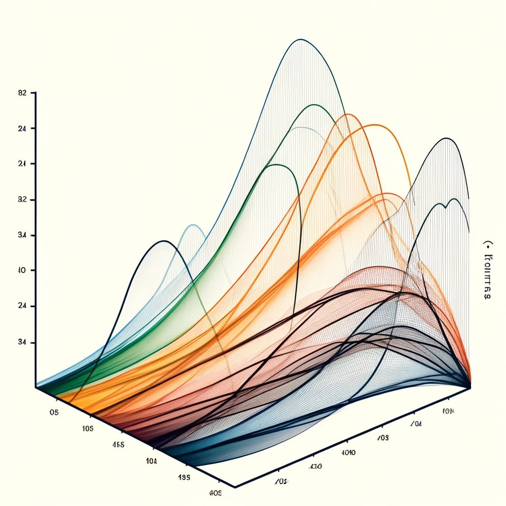
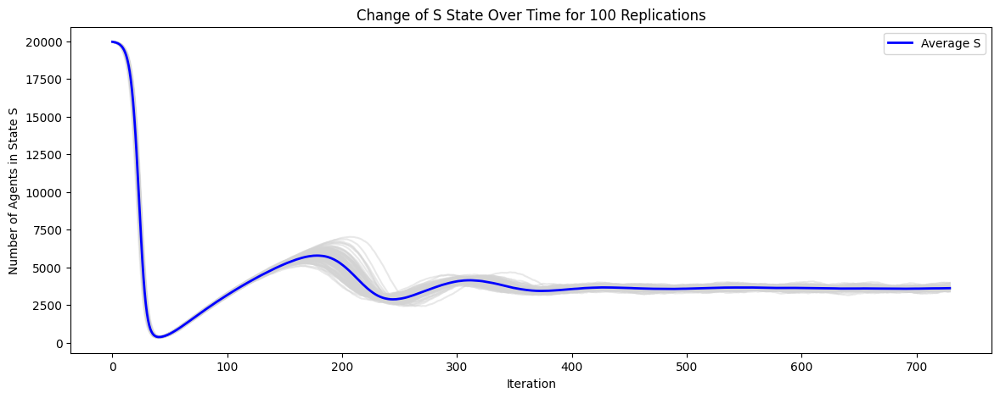
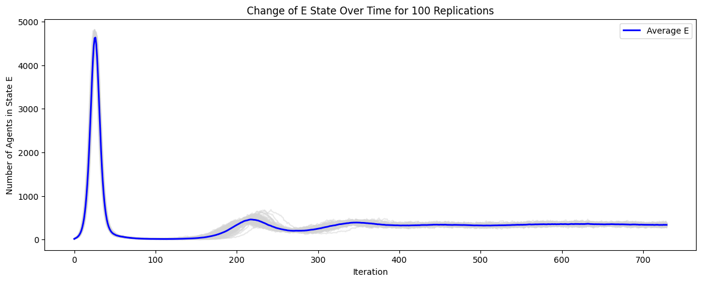
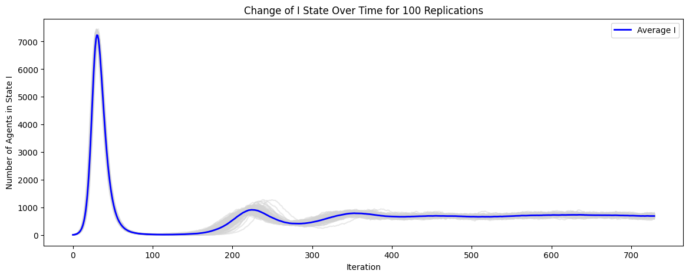
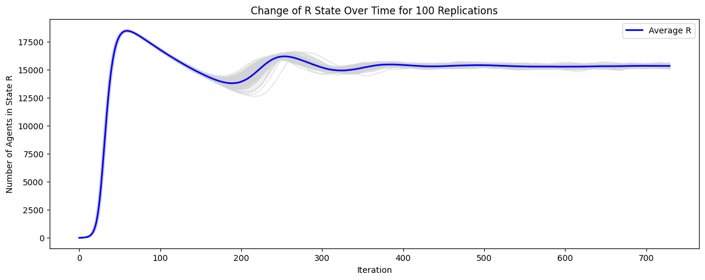

<h1 align="center">SIMULATION TP4</h1>
<h3 align="right">06/04/2024</h3>
<h1 align="center">DÉVELOPPER UN MODÈLE MULTI-AGENT SIMPLE DE PROPAGATION D'UNE MALADIE DANS UNE POPULATION</h1>

  
## Table of Contents

<h3>1. Introduction</h3>
<h3>2. Conception du modèle</h3>
<h3>3. Méthode d'implémentation</h3>
<h3>4. Traitement des données du notebook Jupyter</h3>
<h3>5. Mersenne Twister</h3>

 

	
	 

## 1.Introduction

Ce rapport est dédié à la conception, à l'analyse et à l'évaluation d'un modèle multi-agents simplifié, conçu pour simuler la propagation d'une maladie au sein d'une population déterminée. Il détaille minutieusement les processus de conception et de mise en œuvre ,ainsi que les résultats issus des simulations numériques effectuées.

Le modèle a été développé en utilisant le langage de programmation Java, tandis que l'analyse des résultats a été réalisée à travers Jupyter Notebook. 

## 2.Conception du Modèle

Ce projet vise à élaborer un modèle multi-agents simplifié pour simuler la propagation d'une maladie au sein d'une population spécifique. Le modèle s'appuie sur plusieurs composants clés décrits en détail ci-dessous.

### 1. **Modèle de Grille**
##### 1.1 **Grille (Grid)**
La classe `Grid` représente l'espace de simulation en deux dimensions où sont positionnés les agents représentant les individus. Cette grille est toroïdale, c'est-à-dire que les agents déplaçant au bord réapparaissent de l'autre côté, éliminant ainsi les effets de bord dans la simulation.

### 2. **Modèle Individuel**
##### 2.1 **Individu (Individual)**
La classe `Individual` simule chaque agent dans la simulation. Chaque individu est défini par son état de santé (S, E, I, R), correspondant respectivement aux états Susceptible, Exposé, Infecté et Récupéré. Les transitions entre ces états sont régies par des durées spécifiques (dE, dI, dR), représentant le temps passé dans chaque état, et sont influencées par les interactions avec d'autres agents dans la grille.

##### 2.2 **État (State)**
Cette énumération définit les différents états de santé possibles pour les agents au sein de la simulation.

##### 2.3 **Paramètres (Parameters)**
La classe `Parametres` contient les paramètres de la simulation, y compris les paramètres initiaux de l'état de santé de la population et les coordonnées des individus dans la grille.

### 3. **Simulation**
##### 3.1 **Gestionnaire de Simulation (SimulationManager)**
Le `Gestionnaire de Simulation` coordonne le déroulement de la simulation, contrôlant le flux temporel (un pas de temps correspond à un jour), le mouvement des individus, ainsi que l'application des règles de contagion, d'exposition, de guérison et de perte d'immunité. Pour chaque simulation, 730 itérations sont effectuées, reflétant ainsi le suivi sur deux ans de la dynamique épidémique au sein de la population. Après chaque itération, les données recueillies, telles que le nombre d'individus dans chacun des états S, E, I et R, sont enregistrées et stockées dans des fichiers CSV. 

### 4. **Infection**
##### 4.1 **Gestionnaire d'Infection (InfectionManager)**
Ce composant est responsable de la gestion des processus d'infection au sein de la population. Il détermine les conditions sous lesquelles un individu susceptible (état S) devient exposé (état E) en présence d'individus infectés (état I) et la probabilité de cette transition.

### 5. **Outils**
##### 5.1 **MersenneTwister et random**
La simulation utilise le générateur de nombres aléatoires Mersenne Twister pour toutes les décisions aléatoires, y compris les mouvements aléatoires des individus et les événements d'infection.

## 3.Méthode d'implémentation

### 1. **Modèle de Grille**
##### 1.1 **Grille (Grid)**
1.1.1 **Constructeur Grid:**  
Ce constructeur initialise une nouvelle instance de la grille avec les dimensions spécifiées. Pour chaque cellule de cette grille, une liste vide d'individus est créée pour accueillir les individus qui y seront positionnés plus tard. Cette structure permet de simuler un espace où les individus peuvent interagir.

	public Grid(int width, int height) {
	    this.width = width;
	    this.height = height;
	    grid = new List[width][height];
	    for (int i = 0; i < width; i++) {
	        for (int j = 0; j < height; j++) {
	            grid[i][j] = new ArrayList<>();
	        }
	    }
	}

1.1.2 **Identifier un emplacement spécifique:** 
 Cette méthode positionne un individu sur la grille à une localisation spécifique déterminée par les coordonnées `(x, y)`. Si les coordonnées spécifiées sortent des limites de la grille, elles sont ajustées pour refléter un comportement toroïdal, où les bords de la grille sont connectés entre eux.

	public void placeIndividual(Individual individual, int x, int y) {
	    int wrappedX = Math.floorMod(x, width);
	    int wrappedY = Math.floorMod(y, height);
	    grid[wrappedX][wrappedY].add(individual);
	}

1.1.3 **Obtenir une liste d'emplacements individuels:**  
Renvoie tous les individus présents à une certaine position `(x, y)` sur la grille. Les coordonnées sont ajustées en cas de dépassement pour assurer un accès correct aux cellules, en utilisant le même principe toroïdal que pour le placement des individus.

	public List<Individual> getIndividualsAt(int x, int y) {
	    int wrappedX = Math.floorMod(x, width);
	    int wrappedY = Math.floorMod(y, height);
	    return grid[wrappedX][wrappedY];
	}

1.1.4 **Mouvement individuel:**  
Déplace un individu de sa localisation actuelle vers une nouvelle position spécifiée. Cette méthode gère également le dépassement des limites de la grille pour assurer un comportement toroïdal lors du déplacement.
	
	public void moveIndividual(Individual individual, int oldX, int oldY, int newX, int newY) {
	    int wrappedOldX = Math.floorMod(oldX, width);
	    int wrappedOldY = Math.floorMod(oldY, height);
	    grid[wrappedOldX][wrappedOldY].remove(individual);
	
	    int wrappedNewX = Math.floorMod(newX, width);
	    int wrappedNewY = Math.floorMod(newY, height);
	    grid[wrappedNewX][wrappedNewY].add(individual);
	}

### 2. **Modèle Individuel**
##### 2.1 **Individu (Individual)**

2.1.1 **structure individuelle:**  
Ce constructeur crée une nouvelle instance de `Individual` avec un état initial et des paramètres spécifiques. L'état initial définit l'état de santé de l'individu (par exemple, Susceptible, Exposé, Infecté, Guéri), et les paramètres contiennent des informations supplémentaires telles que la position de l'individu sur la grille. Le temps passé dans l'état actuel est initialisé à 0, indiquant que l'individu vient d'entrer dans cet état.

	public Individual(State initialState, Parameters parameters) {
	    this.state = initialState;
	    this.timeInState = 0; // Le temps dans l'état initial est à 0
	    this.parameters = parameters;
	}

2.1.2 **Cette méthode permet de récupérer l'état actuel de l'individu:**  
L'état représente la condition actuelle de l'individu dans le contexte de la simulation, comme être infecté ou guéri.

	public State getState() {
	    return state;
	}

2.1.3 **Permet de changer l'état de l'individu et réinitialise le temps passé dans cet état à 0:**  
Cette méthode est utilisée pour simuler la transition d'un individu d'un état à un autre, par exemple, de Susceptible à Exposé, tout en réinitialisant le compteur de temps pour refléter le début d'un nouvel état.

	public void setState(State state) {
	    this.state = state;
	    this.timeInState = 0; // Réinitialisation du temps dans l'état
	}

2.1.4 **Renvoie le temps (nombre de pas de simulation) que l'individu a passé dans son état actuel:**   
Cette information est cruciale pour déterminer quand un individu doit passer à un nouvel état, par exemple, de Exposé à Infecté après une certaine période.

	public int getTimeInState() {
	    return timeInState;
	}

2.1.5 **Définit le temps que l'individu a passé dans son état actuel:**  
Cette méthode est utile pour mettre à jour le compteur de temps à chaque pas de simulation, permettant de suivre la durée pendant laquelle un individu reste dans un état spécifique.

	public int setTimeInState(int timeInState) {
	    this.timeInState = timeInState;
	    return this.timeInState;
	}

2.1.6 **Renvoie les paramètres associés à l'individu:** 
 Les paramètres peuvent inclure des informations telles que la position de l'individu sur la grille. Cette méthode offre un accès aux informations nécessaires pour positionner et déplacer l'individu dans l'espace de simulation.

	public Parameters getParameters() {
	    return parameters;
	}

2.2.1 **Statut de dénombrement:**  

	public enum State 
	{
	    SUSCEPTIBLE, 
	    EXPOSED,     
	    INFECTED,    
	    RECOVERED  
	}

2.3.1 **crée un nouvel objet `Parameters`:**  
Ce constructeur crée un nouvel objet `Parameters` avec des coordonnées spécifiques `(x, y)` pour la localisation de l'individu. Il génère également de manière aléatoire les durées passées dans les états Exposé (`dE`), Infecté (`dI`), et Guéri (`dR`) selon une distribution exponentielle négative, représentant le temps que l'individu passe typiquement dans chaque état.

	public Parameters(int x, int y) {
	    this.dE = random.negExp(3);
	    this.dI = random.negExp(7);
	    this.dR = random.negExp(365);
	    this.x = x;
	    this.y = y;
	}

2.3.2 **Renvoie la durée dE que l'individu passe dans l'état EXPOSED:**  
Cette valeur est utilisée pour déterminer quand un individu exposé devient infecté.

	public int getDE() {
	    return dE;
	}

2.3.3 **Renvoie la durée dI que l'individu passe dans l'état INFECTED:**  
Cela aide à calculer quand un individu infecté passe à l'état de RECOVERED.

	public int getDI() {
	    return dI;
	}

2.3.4 **Renvoie la durée dI que l'individu passe dans l'état RECOVERED:**  
Fournit la durée dR durant laquelle l'individu reste dans l'état Guéri avant de potentiellement retourner à l'état Susceptible, simulant ainsi la perte d'immunité.

	public int getDR() {
	    return dR;
	}

2.3.5 **Méthode getX() et getY():** 
Ces méthodes renvoient respectivement les coordonnées x et y de l'individu. Elles sont utilisées pour localiser l'individu dans la grille de simulation.

	public int getX() {
	    return x;
	}

	public int getY() {
	    return y;
	}

2.3.6 **Méthodes setX(int newX) et setY(int newY):**  
Permettent de mettre à jour les coordonnées de l'individu. Elles sont utilisées lors du déplacement de l'individu à une nouvelle position dans la grille.

		public int setX(int newX) {
		    this.x = newX;
		    return x;
		}

		public int setY(int newY) {
		    this.y = newY;
		    return y;
		}

### 3. **Simulation**
##### 3.1 **Gestionnaire de Simulation (SimulationManager)**

3.1.1 **Initialisation de l'Environnement de Simulation:**  
Le constructeur de `SimulationManager` crée une grille bidimensionnelle (`Grid`) avec une taille spécifiée. Il initialise ensuite la population sur cette grille, plaçant les individus (`Individual`) avec un état initial de19980  Susceptible et 20 Infecté, en fonction des paramètres définis.

	public SimulationManager(int width, int height) {
	    this.grid = new Grid(width, height);
	    initializePopulation();
	}
	
	private void initializePopulation() {
	    for (int i = 0; i < 19980; i++) {
	        int x = mt.nextInt(grid.getWidth());
	        int y = mt.nextInt(grid.getHeight());
	
	        parameters = new Parameters(x, y);
	        Individual individualS = new Individual(State.SUSCEPTIBLE, parameters);
	        initPlace(individualS);
	        data.add(individualS);
	    }
	    for (int i = 19980; i < 20000; i++) {
	        int x = mt.nextInt(grid.getWidth());
	        int y = mt.nextInt(grid.getHeight());
	
	        parameters = new Parameters(x, y);
	        Individual individualI = new Individual(State.INFECTED, parameters);
	        initPlace(individualI);
	        data.add(individualI);
	    }
	}

3.1.2 **Placement des Individus:** 
initPlace est une méthode qui positionne un individu sur la grille à partir des coordonnées fournies dans ses paramètres. Cette opération est essentielle pour définir la localisation initiale des individus dans l'environnement de simulation.
	
	private void initPlace(Individual individual) {
	    grid.placeIndividual(individual, individual.getParameters().getX(), individual.getParameters().getY());
	}

3.1.3 **Simulation d'une Étape:**  
La méthode simulateOneStep représente un pas de simulation, équivalent à un jour dans le contexte de la propagation de la maladie. Au cours de ce pas, chaque individu se déplace aléatoirement sur la grille, et son état est mis à jour en fonction des interactions avec d'autres individus et de la durée passée dans l'état actuel.

	public void simulateOneStep() {
	    Collections.shuffle(data, mt);
	
	    for (Individual individual : data) {
	        int x = mt.nextInt(grid.getWidth());
	        int y = mt.nextInt(grid.getHeight());
	
	        grid.moveIndividual(individual, individual.getParameters().getX(), individual.getParameters().getY(), x, y);
	
	        individual.getParameters().setX(x);
	        individual.getParameters().setY(y);
	
	        updateState(individual);
	    }
	
	    day++;
	}

3.1.4 **Mise à Jour de l'État des Individus:**  
`updateState` ajuste l'état de santé des individus en fonction du temps passé dans leur état actuel et des conditions environnementales, telles que la proximité des individus infectés. 

	public void updateState(Individual individual) {
	    InfectionManager infectionManager = new InfectionManager(grid);
	    int timeInState = individual.getTimeInState() + 1;
	    individual.setTimeInState(timeInState);
	
	    switch (individual.getState()) {
	        case EXPOSED:
	            if (timeInState > individual.getParameters().getDE()) {
	                individual.setState(State.INFECTED);
	                individual.setTimeInState(0);
	            }
	            break;
	        case INFECTED:
	            if (timeInState > individual.getParameters().getDI()) {
	                individual.setState(State.RECOVERED);
	                individual.setTimeInState(0);
	            }
	            break;
	        case RECOVERED:
	            if (timeInState > individual.getParameters().getDR()) {
	                individual.setState(State.SUSCEPTIBLE);
	                individual.setTimeInState(0);
	            }
	            break;
	        case SUSCEPTIBLE:
	        default:
	            infectionManager.tryToInfect(individual);
	            break;
	    }
	}

### 4. **Infection**
##### 4.1 **Gestionnaire d'Infection (InfectionManager)**
4.1.1 **Constructeur InfectionManager(Grid grid):** 
Le constructeur de InfectionManager associe le gestionnaire d'infection à une grille (Grid) donnée. 

	public InfectionManager(Grid grid) {
	    this.grid = grid;
	}

4.1.2 **Méthode tryToInfect(Individual individual):** 
`tryToInfect` tente d'infecter un individu en se basant sur le nombre de voisins infectés et une fonction de probabilité. Si le tirage aléatoire est inférieur à la probabilité calculée d'être infecté, l'état de l'individu passe à Exposé (EXPOSED). Cette méthode encapsule la dynamique d'infection, où la proximité des individus infectés augmente la chance d'un individu sain (SUSCEPTIBLE) de devenir Exposé.

	public void tryToInfect(Individual individual) {
	    int nbVoisinsMalade = calculateTotalInfectionsAround(individual.getParameters().getX(), individual.getParameters().getY());
	    double probability = 1 - Math.exp((-1) * 0.5 * nbVoisinsMalade);
	    if (mt.nextDouble() < probability) {
	        individual.setState(State.EXPOSED); 
	    }
	}

4.1.3 **Méthode calculateTotalInfectionsAround:**
Cette fonction calcule le nombre total d'infections autour d'une position donnée (i, j). Elle examine toutes les cellules voisines (y compris la cellule elle-même) pour compter le nombre d'individus infectés. Cette évaluation est essentielle pour la méthode tryToInfect, car elle détermine la probabilité qu'un individu devienne infecté en se basant sur la densité d'infections dans son voisinage immédiat.

	public int calculateTotalInfectionsAround(int i, int j) {
	    int totalInfections = 0; 
	
	    // Vérifier toutes les cellules voisines (y compris la cellule elle-même)
	    for (int x = i - 1; x <= i + 1; x++) {
	        for (int y = j - 1; y <= j + 1; y++) {
	            List<Individual> individuals = grid.getIndividualsAt(x, y);
	            long infectionsCount = individuals.stream()
	                                              .filter(ind -> ind.getState() == State.INFECTED)
	                                              .count();
	            totalInfections += infectionsCount;
	        }
	    }
	
	    return totalInfections; 
	}

### 5. **Outils**
##### 5.1 **MersenneTwister et random**
5.1.1 **Définition de la graine du générateur de nombres aléatoires** 
`setSeed` permet de définir une graine pour le générateur de nombres aléatoires `MersenneTwister`. En initialisant le générateur avec une graine spécifique, on peut reproduire exactement la même séquence de nombres aléatoires, et par conséquent, la même dynamique de simulation.

	public static void setSeed(long seed) {
	    mt.setSeed(seed);
	}

5.1.2 **Accès à l'instance singleton de MersenneTwister:** 
`getInstance` fournit un accès global à l'instance singleton de `MersenneTwister`. Cette méthode garantit que la simulation utilise une unique instance du générateur partout, facilitant la gestion de l'état aléatoire.

	public static MersenneTwister getInstance() {
	    return mt;
	}
5.1.3 **Génération de nombres basée sur une distribution exponentielle négative:** 
`negExp` génère un nombre aléatoire selon une distribution exponentielle négative. 

	public static int negExp(double inMean) {
	    return (int) (-inMean * Math.log(1 - mt.nextDouble()));
	}

## 4.Traitement des données du notebook Jupyter
Ce script Python a pour objectif de visualiser la dynamique de propagation d'une maladie au sein d'une population simulée, en se basant sur les résultats de simulations enregistrés dans des fichiers CSV. Il permet de tracer l'évolution du nombre d'individus dans différents états de santé (SUSCEPTIBLE, EXPOSED, INFECTED, RECOVERED) au cours du temps, à travers 100 réplications de la simulation.

### Méthode d'Implémentation

1. **Lecture des fichiers CSV** : Le script commence par rechercher tous les fichiers CSV correspondant à un motif défini (`simulation_result_*.csv`) dans le répertoire des résultats de simulation. Chaque fichier contient les données d'une réplication de la simulation, incluant le nombre d'individus dans chaque état de santé à chaque itération.

2. **Vérification de la présence des données** : Le script vérifie si des fichiers correspondants ont été trouvés. Si aucun fichier n'est trouvé, un message est affiché pour indiquer l'absence de données. Sinon, il procède à la lecture des fichiers et au stockage des données dans une liste de dataframes (`data_frames`).

3. **Tracé des graphiques** : Pour chaque état de santé (`S`, `E`, `I`, `R`), le script génère un graphique montrant l'évolution du nombre d'individus dans cet état au fil du temps, pour chaque réplication de la simulation. Les données de chaque réplication sont tracées en gris clair pour montrer la variabilité entre les réplications. Ensuite, la moyenne du nombre d'individus dans l'état concerné, calculée sur toutes les réplications, est tracée en bleu pour mettre en évidence la tendance générale.

4. **Affichage des résultats** : Chaque graphique est titré avec le nom de l'état de santé correspondant et indique le changement du nombre d'individus dans cet état au cours des itérations. Les axes sont correctement étiquetés pour indiquer les itérations (sur l'axe des abscisses) et le nombre d'individus (sur l'axe des ordonnées). Un légende est également affichée pour identifier la courbe moyenne.

	import pandas as pd
	import numpy as np
	import matplotlib.pyplot as plt
	import glob
	
	file_pattern = './simulation_results/simulation_result_*.csv'
	file_list = glob.glob(file_pattern)
	
	if not file_list:
	    print("No files found")
	else:
	    data_frames = [pd.read_csv(file) for file in file_list]
	
	    if data_frames:
	        states = ['S', 'E', 'I', 'R']
	        
	        iterations = data_frames[0]['Iteration']
	
	        for index, state in enumerate(states):
	            plt.figure(figsize=(14, 5))
	
	            for df in data_frames:
	                plt.plot(df['Iteration'], df[state], color='lightgray', alpha=0.5)
	            
	            average_state = np.mean([df[state].values for df in data_frames], axis=0)
	            
	            plt.plot(iterations, average_state, color='blue', label=f'Average {state}', linewidth=2)
	            plt.title(f'Change of {state} State Over Time for 100 Replications')
	            plt.xlabel('Iteration')
	            plt.ylabel(f'Number of Agents in State {state}')
	            plt.legend()
	            
	            plt.show()
	    else:
	        print("No data to plot.")

	
	 
*Figure 1 : Courbe des individus SUSCEPTIBLES sur 100 simulations, avec la courbe moyenne, sous 730 itérations d'expérience.*

	
	 
*Figure 2 : Courbe des individus EXPOSED sur 100 simulations, avec la courbe moyenne, sous 730 itérations d'expérience.*

	
	 
*Figure 3 : Courbe des individus INFECTED sur 100 simulations, avec la courbe moyenne, sous 730 itérations d'expérience.*

	
	 
*Figure 4 : Courbe des individus RECOVERED sur 100 simulations, avec la courbe moyenne, sous 730 itérations d'expérience.*

    
## 5.Mersenne Twister

**Version:** Mersenne Twister dans ECJ

**Langage:** Java

**Graine:** Dans la fonction principale, utilisez le nombre de lectures de chaque fichier CSV comme graine pour personnaliser le Mersenne Twister, évitant ainsi l'utilisation de l'heure par défaut comme graine.
